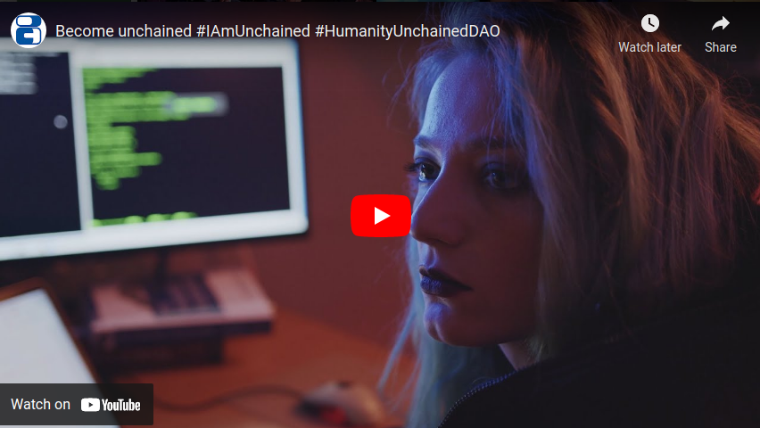

[ [English](README.md) | [Español](README_ES.md) ]

# Roadmap Proposal to Humanity Unchained DAO

Version 1.1 / 2022-08-24

## Preamble

This document is a roadmap proposal for the community of [Humanity Unchained DAO](https://humanityunchained.org) to transition to the **New Free World**, as we will describe later. HUD is a [Decentralized Autonomous Organization](https://en.wikipedia.org/wiki/Decentralized_autonomous_organization) running an on-chain semi-direct democracy on the Polygon network using [Proof of Humanity](https://www.proofofhumanity.id) as an identity registry.

We based our proposal on various resources, being [Balaji Srinivasan's new book "The Network State"](https://thenetworkstate.org) one of the best available.
We strongly recommend to read it for those who want to understand the principles, goals and roadmap of [Humanity Unchained DAO (HUD)](https://humanityunchained.org).

We would like to present the following proposal to the HUD community and humanity in general.

## Goal

We define the **New Free World (NFW)** as a world in which human beings can freely choose the [social contract](https://en.wikipedia.org/wiki/Social_contract) they wish to live in, and even create new ones.

In such a world, every human being has not only the right but also the ability to opt out from the [state](https://en.wikipedia.org/wiki/State_(polity)) that he/she was imposed at birth and opt in to other social contracts among many available. In the *NFW*, a global liquid market of [network states](https://thenetworkstate.com/the-network-state-in-one-sentence) (as Balaji describes in his book) that implement *smart social contracts* has emerged. This way, social contracts compete for citizens' loyalty to survive. This new social structure and governance paradigm direcly tackles the root of long-standing problems of humanity such as war, institutional corruption, financial slavery and undevelopment.

Our goal is:

> To accelerate the transition to the New Free World (NFW) by building the first network state at global scale, so it can be replicated and improved by others. For that, this state will use [Humanity Unchained DAO (HUD)](https://humanityunchained.org) as the technology tool serving as a legitimacy source, democratic dispute resolution and decision-making tool.
>
> We strongly believe we need to achieve the NFW urgently before humanity crosses the *point of no return* that will trap humanity in a technocratic feudalistic dystopia.

To know more about our ideas and proposed roadmap, subscribe to any updates on this repository and our [website](https://new-free-world.org/).

## Implementation

We propose a way to materialize our goal through the creation of geographical concentrations of *HUD* citizens in specific regions across the world, by exercising the right of citizens to move freely within the borders of a state, in order to achieve a democratic majority in alignment with the principles of HUD in those regions. This majority will make the necessary changes to the region's legislative framework for the region to become part of HUD network of clusters. More information is available on the [Emmental Project](projects/Emmental/README.md)

From an organizational perspective, the backbone structure of the DAO will be based on the assignment of a special type of Non-Fungible Tokens which we call `emblems`. A way to understand how `emblems` work is that of
Create an structured and    by the DAO
More information is available on our specification of the [emblem tokens](emblems.md)

### Projects

For implementation of the goal, we propose the following *projects* to start with:

|Name|Summary|
| --- | --- |
|[Emmental](projects/Emmental/README.md)| The goal of the **Emmental Project** is to create a geographical concentration of [Humanity Unchained DAO](https://humanityunchained.org) citizens in specific regions all over the world, through exercising their legal right to move freely within the boards of their legacy states, to achieve a democratic majority that supports the principles of the HUD. This idea is inspired by the [Free State Project](https://en.wikipedia.org/wiki/Free_State_Project).|
|[Genesis Tokens](projects/GenesisTokens/README.md)| A way to commemorate the birth of Humanity Unchained DAO by selling a limited number of tokens on an auction. The value of the tokens may, in principle, be solely honorific and/or artistic. We also propose to allocate part of the funds in the [UBI Burning Vault](http://app.democracy.earth/). The DAO shall decide the percentage.|
|[Identity Registry](projects/IdentityRegistry/README.md)| A identity registry system based on [Proof of Humanity](https://www.proofofhumanity.id) that takes the most of HUD to create a better identity system in terms of governance, scalability and cost. |

### DAO's periodical voting

On-chain votings shall be performed on a weekly basis on certain days, as long as there are pending votings. The following is an example:

|Voting|Transaction|Purpose|
| --- | --- | --- |
|1|1| Update the PoH oracle.|
| |2| Fix a bug in one of the smart contracts.|
| |3| Transfer tokens from the DAO's wallet to pay members or third-parties.|
| |4| Change a parameter of one of the smart contracts.|
| |5| Assign emblems of type `guild` to the candidates selected via off-line voting.|
| |6| Create a new `emblem` of type `project` to start a new project.|
| |7| Assign the new `project` to the candidates selected via off-line voting.
|2|1| Expel a member of the DAO due to dishonest behavior towards the community.|

As a general rule, transactions likely to be approved should be grouped in the same voting. The goal is to minimize the risk of having to repeat a voting again. Off-chain voting may serve as a fair predictor of whether the transaction will be approved on-chain. Transactions whith an unclear forecast (i.e. expeling a member of the DAO might be a controversial issue that divides the community in half) will be voted separatedly.

## Other technical improvements

You can see HUD's GitHub issues [here](https://github.com/hhh01398/hud/issues). The issue [#16 Support multiple transactions in a single voting](https://github.com/hhh01398/hud/issues/16) is paramount to move forward faster by lowering the number of votings needed.

## Schedule

The following is an orientative schedule. Community Calls will be hold on the Telegram groups. Off-chain voting will be done in [HUD's Snapshot](https://snapshot.org/#/humanityunchaineddao.eth).

|Event|Details|
| --- | --- |
|Community Call (English)| Friday @ 9PM CET|
|Community Call (Spanish)| Thursday @ 11PM CET|
|Off-chain votings start| Any day|
|Off-chain votings end| Next week's Thursday|
|On-chain voting start| Saturday|
|On-chain voting ends| Monday|

**Note**: Change on the schedule may be announced on short notice, so stay tuned for any updates in the Telegram groups.

## Calendar

**Note**: The following calendar is an estimate. We may be forced to change it on short notice because of diverse reasons such as time constrains and limited resources.

|Milestone|Estimated Date|Status|
| --- | --- | --- |
|Voting of [#16 Support multiple transactions in a single voting](https://github.com/hhh01398/hud/issues/16) | 07-25 Mon | Proposal was rejected. Pending re-submission. |
|Voting of PoH oracle update | September| On schedule |
|Voting of: - Genesis Token minting - Emblems minting - PoH oracle update - Technical improvements | September| On schedule |