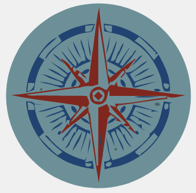

[ [English](README.md) | [Español](README_ES.md) ]

# Propuesta de Hoja de Ruta para Humanity Unchained DAO

Versión 1.0 / 2022-07-24

Este documento es una propuesta de hoja de ruta para la comunidad de [Humanity Unchained DAO (HUD)](https://humanityunchained.org). HUD es una [DAO](https://es.wikipedia.org/wiki/Organizaci%C3%B3n_aut%C3%B3noma_descentralizada) que implementa una democracia semi-directa on-chain en la cadena de bloques de Polygon usando [Proof of Humanity (PoH)](https://www.proofofhumanity.id) como censo.

Hemos basado nuestra propuesta en diferentes fuentes, siendo el reciente [libro de Balaji Srinivasan, "The Network State: How To Start a New Country"](https://thenetworkstate.com) una de las mejores disponibles. Recomendamos encarecidamente su lectura a todo aquel que quiera entender los principios, objetivos y hoja de ruta de Humanity Unchained DAO.

Nos gustaría presentar la siguiente propuesta a la comunidad.

## Objetivo

Definimos el **Nuevo Mundo Libre (NML)** como un mundo en el que los seres humanos puede elegir libremente el [contrato social](https://es.wikipedia.org/wiki/Contrato_social) en el que desean vivir, o incluso crear nuevos contratos sociales.

En dicho mundo, todo ser humano tiene no solamente el derecho sino también la capacidad de cancelar el contrato social impuesto por el estado en el que nació y elegir otros contratos sociales de entre muchos disponibles. En el *NML*, existe un mercado líquido y global de *redes estado* o [*network states*](https://thenetworkstate.com/the-network-state-in-one-sentence) (como describe Balaji en su libro) que implementan *contratos sociales inteligentes*. De esta forma, los contratos sociales compiten por la fidelidad de sus ciudadanos para sobrevivir. La consolidación de este nuevo paradigma social soluciona de forma indirecta una gran parte de los problemas de la humanidad relacionados con la guerra, la corrupción y la pobreza.

Nuestro objetivo es:

> Acelerar la transición al Nuevo Mundo Libre (NML) mediante la creación de la primera *red estado* a escala global, de tal manera que otros puedan replicarla y mejorarla. Para ello, este estado usa [Humanity Unchained DAO (HUD)](https://humanityunchained.org) como herramienta tecnológica necesaria para su desarrollo.
>
> Creemos que es de extrema urgencia que la humanidad consiga el *NML* antes de se alcance el *punto de no retorno* hacia una distopía tecnocrática en la que la humanidad se vea atrapada indefinidamente.

Si deseas saber más sobre nuestro principios e ideas, visita nuestro [blog](https://mirror.xyz/0x52E0b45F59e58a10ABbe105F00ac771CFee814be)

## Implementación

Toda organización necesita algún tipo de estructura para funcionar. Por tanto, necesitamos una herramienta fiable que nos permita organizar un comunidad de millones de seres humanos de forma descentralizada. Para ello, proponemos el uso de un tipo especial de NFT con el cual la comunidad de HUD puede asignar democráticamente roles a ciudadanos y crear grupos de trabajo. La DAO decidirá qué roles se necesitan y qué ciudadanos los desempeñan, basándose en los criterios que la DAO considere oportuno, no necesariamente económicos (como las actuales *tokencracias*) o impuestos a nosotros mismos mediante un algoritmo. Estos criterios pueden ser, por ejemplo, la reputación, la confianza, el mérito, el profesionalismo o el compromiso con el objetivo de la DAO. Llamamos a este tipo de NFT `emblems` (en español, *emblemas*) .

Los `emblems` tienen las siguientes caracteríticas:

- Solo la DAO puede crearlos, destruirlos y transferirlos.
- Solo los ciudadanos de la DAO pueden recibirlos.
- Los portadores no pueden transferir el emblema, ni siquiera a otro ciudadano, pero siempre pueden renunciar al emblema devolviéndolo a la DAO.
- La DAO puede retirar el emblema a su portador.

Podemos usar `emblems` para organizar la DAO de muchas maneras. Para empezar, proponemos el crear dos tipos de emblemas: `guilds` (en español, *gremios*) and `projects` (en español, *proyectos*).

Los `guilds` son grupos de ciudadanos que comparten ciertas habilidades. Los `projects` son grupos de ciudadanos que trabajan colaborativamente en una tarea concreta. Los ciudadanos con `emblems` de un `project` son los responsables del mismo: toman las decisiones, planifican, organizan sus equipos, administran los recursos que tengan disponibles, e informan de novedades al resto de HUD (por ejemplo, en las community calls).

Por ejemplo: el proyecto `P` necesita 3 ciudadanos a tiempo completo de la guild `G1`, 2 ciudadanos de la guild `G2` and 1 ciudadano de la guild `G3`.

Nótese que un mismo ciudadano puede pertenecer a varios `guilds` y a varios `projects` a la vez.

Hay un número limitado de tokens por tipo de `emblem`, ya que la DAO decidirá cuantos tokens crear o destruir de acuerdo con las necesidades de cada momento. La DAO debe decidir sabiamente a quién asignar los emblemas, ya que cada `emblem` conlleva obligaciones y responsabilidades. Como tales, los emblemas son un acuerdo entre el ciudadano y la DAO. Si el ciudadano descuidara sus responsabilidades hacia la DAO, la DAO puede retirarle el `emblem` y la reputación del ciudadano sería dañada inevitablemente.

El resultado de usar `emblems` de esta forma es una organización de estructura plana en la que la comunidad entera, no un grupo minoritario, es plenamente soberana para asignar o retirar roles y tareas a cualquier miembro de la DAO en cualquier momento. En el futuro, prevemos que los `emblems` otorgen ciertos permisos en determinadas funciones de los contratos inteligentes de HUD.

### Guilds

Proponemos las siguientes *guilds* para empezar:

|Nombre|Imagen|Responsabilidades|
| --- | ---- | --- |
|Mods||Se encargan de la moderación de las redes sociales de la DAO, como p.ej. los grupos de Telegram. También responden las preguntas de la comunidad, informan de novedades y ayudan a crear un buen clima de cooperación.
|Artists||Crean el artwork de los tokens. Inspiran a la comunidad con sus creaciones. Contribuyen al diseño de interfaces atractivas para el usuario.|
|Devs||Son responsables de constuir y mantener la infrastructura técnica, como los contratos inteligentes, dapps, páginas web, repositorios de código, claves de ENS, mantener la lista de nuevas funcionalidades y arreglo de errores, etc. También tienen un papel muy importante en transmitir a la comunidad conocimiento en temas de ciber seguridad. |
|Legals||Son el enlace entre el *mundo legado* y el Nuevo Mundo Libre. Asesoran a la comunidad en temas legales. Por ejemplo, si la DAO quisiera adquirir activos disponibles solo a través de los mecanismos del *mundo legado*, no a través de Web3 (como terrenos, edificios, etc.), los `legals` se encargarían de crear las estructuras legales para hacerlo de la mejor forma posible.|
|Medias||Son los portavoces de la DAO. Son responsables de todo lo relacionado con comunicacion oficial de la misma a través de las redes sociales y medios de comunicacion tradicionales. Se encargan de la difusión de noticias de HUD a través diferentes canales y en diferentes idiomas, la creación de contenidos en diferentes formatos, la estrategia comunicativa, publicidad, etc. |

### Projects

Proponemos los siguientes *projects* para empezar:

|Nombre|Resumen|
| --- | --- |
|[Genesis Tokens](projects/GenesisTokens/README_ES.md)| Una forma de conmemorar el nacimiento de Humanity Unchained DAO subastando un número limitado de NFTs. El valor de los tokens podría ser, en principio, meramente honorífico y/o artístico. La DAO decidirá en qué dedicar los fondos obtenidos. Proponemos el invertir una parte de los fondos en el [UBI Burning Vault](http://app.democracy.earth/), y que la DAO decida qué porcentage.|
|[Emmental](projects/Emmental/README_ES.md)| El objetivo del **Proyecto Emmental** es crear una concentración geográfica de ciudadanos de [Humanity Unchained DAO](https://humanityunchained.org) en regiones específicas de todo el mundo, mediante el ejercicio del derecho legal de libertad de movimiento dentro de los estados, para conseguir una mayoría democrática que defienda los principios de HUD. Esta idea esta inspirada en el proyecto [Free State Project](https://en.wikipedia.org/wiki/Free_State_Project).
|[Identity Registry](projects/IdentityRegistry/README_ES.md)| Un sistema de registro de identidad basado en [Proof of Humanity](https://www.proofofhumanity.id) pero que se aproveche de las características de HUD para crear un sistema mejor en términos de governanza, escalabilidad y coste.|
|[Staking](projects/Staking/README_ES.md)| Un sistema de staking que proporciona un nuevo parámetro de reputación que la DAO pueda usar como criterio extra en la asignación de determinados roles o proyectos a ciudanos. |

### Cómo crear o obtener un `emblem`

Crear una `guild` significa que la DAO reconoce la necesidad de identificar un determinada habilidad, especialización o rol dentro de la DAO para cumplir el objetivo. Crear una `project` significa que la DAO reconoce la necesidad de empezar un nuevo project o tarea determinada, y destinar recursos a la misma.

Si un ciudadano desea unirse a una `guild` o a un `project`, debe de proponer su candidatura públicamente a la comunidad y someterse al criterio de selección que la DAO requiera. Es decir, el candidato tiene que convencer a la DAO.

En cualquiera de los casos, la DAO tiene que aprobar democráticamente una transacción que cree y/o asigne un `emblem`. Como toda votación, se recomienda primero proponer la idea a la comunidad en el [foro](https://forum.humanityunchained.org/), para su posterior votación off-chain y, finalmente, votación on-chain.

### Ejemplo de proceso de votación on-chain

Cada semana se celebrarán votaciones on-chain en determinados días, siempre que haya votaciones pendientes. Ilustramos el proceso con el siguiente ejemplo:

|Votación|Transacción|Propósito|
| --- | --- | --- |
|1|1| Actualizar el oráculo de Proof Of Humanity.|
| |2| Arreglar un *bug* en uno de los contratos inteligentes.|
| |3| Transferir tokens de la billetera de la DAO para pagar a miembros de la comunidad o a terceros.|
| |4| Cambio de uno de los parámetros de los contratos inteligentes.|
| |5| Asignar emblemas de tipo `guild` a los candidatos previamente seleccionados via votación off-chain.|
| |6| Crear un nuevo `emblem` de tipo `project` para realizar un nuevo proyecto.|
| |7| Asignar el nuevo `project` a los candidatos previamente seleccionados via votación off-chain.|
|2|1| Expulsión de un miembro de la DAO por conducta deshonesta hacia la comunidad.|

Como normal general, se agruparán en una misma votación las transacciones que tengan una alta probabilidad de ser aceptadas. La finalidad de ello es minimizar el riesgo de tener que repetir votaciones. El resultado de la votación on-chain puede estimarse a través de una votación off-chain previamente celebrada. Las transacciones cuyo veredicto final no pueda estimarse claramente (p.ej. la expulsión de un miembro de la DAO debido a un tema controvertido que divida a la comunidad en partes iguales) se votarán a parte.

## Otras mejoras técnicas

Clica [aquí](https://github.com/hhh01398/hud/issues) para ver los `issues` del repositorio de HUD en GitHub. Especialmente necesario es [#16 Support multiple transactions in a single voting](https://github.com/hhh01398/hud/issues/16), ya que nos permitirá agrupar varias transacciones en una sola votación como describimos anteriorment. Así podremos avanzar más rápido al reducir el número de votaciones necesarias.

## Horarios

Los siguientes horarios son orientativos. Las Community Calls se celebrarán en los grupos de Telegram de HUD. Las votaciones off-chain se harán en el [Snapshot de HUD](https://snapshot.org/#/humanityunchaineddao.eth).

|Event|Details|
| --- | --- |
|Community Call (Inglés)| Viernes @ 9PM CET|
|Community Call (Español)| Jueves @ 11PM CET|
|Comienzo de votaciones off-chain | Cualquier día|
|Finalización de votaciones off-chain | El jueves de la semana siguiente al comienzo de la votación|
|Comienzo de votaciones on-chain| Sábados|
|Finalización de votaciones on-chain| Lunes|

**Atención**: Puede que se anuncien cambios de última hora, por lo que se recomienda estar atentos a cualquier novedad en los grupos de Telegram.

## Calendario

**Atención**: El siguiente calendario es una estimación. Puede que nos veamos obligados postponer un hito con poca antelación debido a falta de tiempo y recursos limitados.

|Hito|Fecha Estimada|Estado|
| --- | --- | --- |
|Votación de [#16 Support multiple transactions in a single voting](https://github.com/hhh01398/hud/issues/16) | 25-07 Lun | A tiempo |
|Votacion para actualización del oráculo de PoH | 30-07 Sáb | A tiempo |
|Votacion para: - Creación de Genesis Token - Creación de Emblemas - Actualización del oráculo de PoH - Otras mejoras técnicas | 05-08 Sáb | A tiempo |