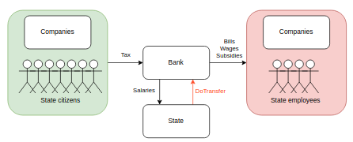
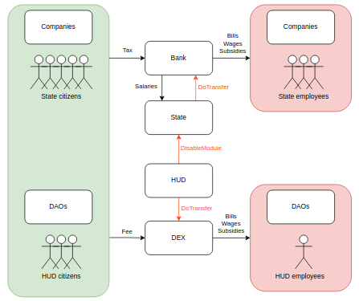
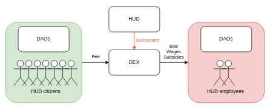

[ [English](README.md) | [Español](README_ES.md) ]

# Emmental Project

> Draft 0.2 / 2022-08-24

The goal of the **Emmental Project** is to create a geographical concentration of [Humanity Unchained DAO (HUD)](https://humanityunchained.org) citizens in specific regions across the world, by exercising the right of citizens to move freely within the borders of a state, in order to achieve a democratic majority in alignment with the principles of the DAO in those regions. This majority will make the necessary changes to the region's legislative framework for the region to become part of HUD network of clusters. This idea is inspired by the [Free State Project](https://en.wikipedia.org/wiki/Free_State_Project).

The name *"Emmental"* is after the famous Swiss cheese with holes, as that is how the political map of the world would look like if the project becomes successful. The holes would represent the regions with a majority of HUD members, which we call *clusters*.

<figure>

 <figcaption>
A hypothetical example of clusters in Europe. Different colors represent regions administered by one or more Network States, Humanity Unchained DAO among them.
</figcaption>
</figure>

<figure>

 <figcaption>
Draft of Humanity Unchained DAO's cluster page 
</figcaption>
</figure>

The *Emmental* approach has several advatanges over to the approach of crowfunding a territory and build a state from scratch, such as:

1. No need for financial resources.

2. Multiple executions, even among overlapping territories (for example, at local, regional, national and supranational levels), can be run in parallel with the same framework.

3. The infrastructure is already built. Not only in physical terms, such as energy and water system, garbage disposal, communications, etc. but also in social and legal terms.

### Phases

The following phases are proposed:

|Phase|Description|
| --- | --- |
|Selection| The community debates on what criteria use to select the regions. The following criteria could be used:   - **Legislation:** Laws in the region must allow citizens to move freely and the posibility to change the laws and regulations of the region through democratic means.   - **Political sentiment:** The closer to HUD ideas the political sentiment of the region is, the easier it will be to create a new political majority.   - **Population:** Changing the political sentiment of a region is more plausible if the initial number of inhabitants in the region is lower.   - **Economy:** The region's economy should be expanding, both in terms of job offers and accommodation, in order to better absorb the influx of immigrants.   - **Natural resources:** The region must have natural resources (rivers, minerals, arable land, etc.) and explotation systems (dams, mines, crops, etc.) so the region can be as much self-sufficient as possible.   - **Infrastructures:** The region should be connected with other regions by land, water and air.
|Crowfunding| Optionally, the community crowfund the project through, for example, the issuance of a specific emblem token that allows the holder to enjoy certain services or run certain positions once the `Settlement` phase is reached. |
|Signaling| HUD members who want to move permanently to one of the selected areas must share it with the community in the first place. |
|Deposit| Once a minimum number of HUD members is reached for a region, the members must make a deposit in a smart contract created for such purpose. The funds will be unlocked on the condition that the member finally moves. |
|Moving| The HUD members move to the region. A proof of location should be provided in order to unlock the deposited funds. |
|Settlement| The HUD members live in the new region and join the political affairs there with the goal to build a democratic majority that supports the principles of HUD. |
|Upgrade| A certain level of democratic power is reached that allows HUD to implement actual changes towards a fully-fledged cluster of HUD network state |

The actual migration from the Legacy System to a New Free World system cannot be done overnight but it must be done progressively by implementing small changes, which can be divided into the following sub-phases within the Upgrade phase:

**Phase: Upgrade-0**

**Legislation:** All legislation is fully off-chain.

**Organization:** Corruption-prone, with no practical mechanisms for revocation of state employees, lack of transparency and accountability, nor screening criteria to pick candidates.

**Finance:**

**Phase: Upgrade-1**

**Legislation:** Several modules are migrated from off-chain to on-chain.

In this phase, it is possible for the DAO to propose ammendments to the current legislation in all the areas of the state, such as the judicial system, migration policy, taxation, etc. This changes are needed as a middle step before the actual on-chain migration of the whole system. As an example, the image below shows a hypothetical change of one article of the Constitution of Spain that describes the current centralized corruption-prone process of selection of judges of the *Supreme Court*:

You can see the [diff here](https://github.com/hhh01398/HUD_cluster_Spain_EN/compare/current...proposal1)

**Organization:** Holding an emblem token is needed to run a main position as state employee, such as prime ministers, presidents, supreme court judges, mayors, heads of departments or ministries, etc. The DAO can assign and revoke these tokens.

**Finance:**

**Phase: Upgrade-2**

**Legislation:** Legislation is migrated fully on-chain through smart contracts, wherever technically possible. Implementation of new rules or change of current rules need the approval of a transaction through on-chain voting

**Organization:** Every transaction can be monitored, approved and/or revoked by the DAO, as well as any official appointment, through the use of emblem tokens. Note that the official roles and responsibilities have been replaced by smart contracts. The officials in this phase are in charge of tasks which cannot be automated yet, such as building and maintaining code, advocating for proposals, etc.

**Finance:**

## Result

|Area|Problem|Solution
| --- | --- | --- 
|Economy | Inflation | 
|Geopolitics | Wars | 
|Public services | Wars | 
|Insitutional corruption | Wars |

...TODO

## Ambassadors

### Responsibilities

The goal of ambassadores is to lead the project within a cluster, growing the number of HUD members who join it, ultimately reacing the democratic majority within the cluster.

For that, ambassadors have full autonomy within the cluster to:

- Represent HUD officially.
- Advocate HUD.
- Create work teams, social network accounts, local communities, etc.

The role of ambassador will be assigned through [emblem tokens](../../emblems.md).

Like any other member of the DAO, ambassadors can create emblems to form task forces or teams. As creator of such emblem tokens, they can asign them to those HUD members they trust, through the means and criteria they consider appropriate (directly, through democratic polling, etc.). The fundamental aspect here is that every transaction, such as token minting and transfer, is under the implicit supervision and potential revokation, if needed, of the DAO as a whole.

### How to become an ambassador

1. First, you must submit your application to the forum [foro](https://forum.humanityunchained.org/c/role-introductions). If your cluster is not yet available in the forum, feel free to create a thread for that yourself. Then, whare the URL to your application post to the community in the Telegram group.

2. In the following days, your application will be voted (accepted or rejected) off-chain through snapshot.org.

3. If your application is accepted off-chain, an on-chain voting will be carried out to transfer the emblem to your address.

4. In order to receive and hold the emblem token, you must stake certain number of HUD tokens.

## List of clusters

|Cluster|Ambassador|Emblem|
| --- | --- | --- |
| Argentina | (pending) |  |
| España | (pending) |  |

