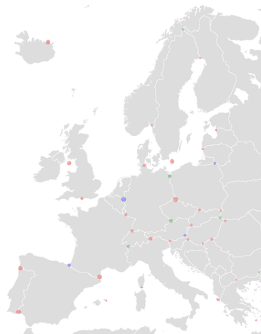
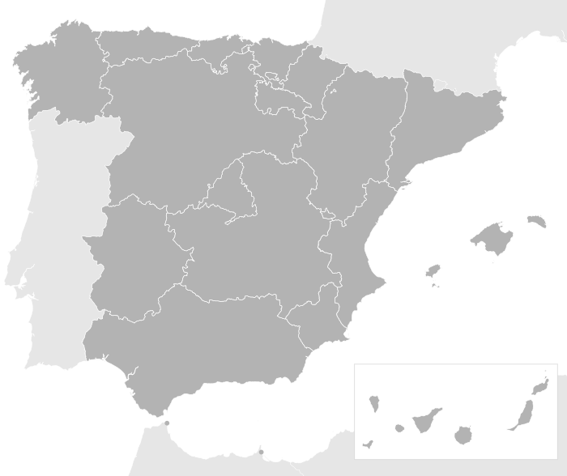

[ [English](README.md) | [Español](README_ES.md) ]

# Proyecto Emmental

> Borrador 0.2 / 2022-08-11

El objetivo del **Proyecto Emmental** es crear una concentración geográfica de miembros de [Humanity Unchained DAO (HUD)](https://humanityunchained.org) en regiones específicas distribuidas por todo el mundo para así conseguir una mayoría democrática que defienda los principios de HUD en dichas regiones. Esta idea está inspirada en el proyecto [Free State Project](https://es.wikipedia.org/wiki/Free_State_Project).

El nombre *"Emmental"* viene del famoso queso suizo con agujeros, ya que así es cómo el mapa político del mundo parecerá si el proyecto tiene éxito. Los agujeros del queso representarían las regiones con mayoría de miembros de *HUD*, también llamadas *clusters*.

<figure>

 <figcaption>
Hipotético ejemplo de clusters en Europa. Los diferentes colores representan regiones administradas por uno o mas Estados Red, entre ellos Humanity Unchained DAO.
</figcaption>
</figure>

# Embajadores

## Responsabilidades

El objetivo de los embajadores es de hacer crecer el número de miembros de Humanity Unchained DAO en sus respectivos clusters y llegar a alcanzar una mayoría democrática en el cluster.

Para ello, los embajadores tiene plena autonomía dentro de los clusters para:

- Representar a HUD oficialmente.
- Promulgar HUD.
- Crear grupos de trabajo, redes sociales, etc.

Como cualquier otro usuario de la red, los embajadores pueden crear emblemas para crear grupos de trabajo, de los cuales son administradores y pueden asignarnos a otros miembros de HUD mediante el criterio y método que quieran (p.ej. asignación directa, concurso público, por votación democrática, etc.)

## Caracteristicas del emblema de embajador

La DAO es la única entidad que puede transferir, bloquear, pausar, crear, destruir o retirar cualquier emblema. Si un embajador quisiera renunciar a su cargo, puede hacerlo transfiriendo su emblema a la DAO. Para ser portador del emblema de embajador, el portador tiene que *stakear* un numero determinado de HUD tokens. Si en algún momento el portador no tuviera dicha cantidad de tokens en *stake*, cualquiera puede ejecutar una transacción para retirarle dicho token y devolverlo a la DAO.

Si el embajador no cumpliera las espectativas de la comunidad, la DAO puede votar para retirar el emblema al embajador así como penalizarlo retirándole los tokens *stakeados*.

Ejemplo:

- La DAO decide crear y transferir un emblema de embajador de cluster C al ciudadano con direccion H1.
- El embajador H1 crea un emblema E y lo asigna a ciudadanos de confianza en diferentes provincias o ciudades que desenpenan otras tareas.
- La DAO decide retirar el emblema de embajador de cluster C al ciudadano con direccion H1 y transferirlo al ciudadano con direccion H2. La DAO decide destruir el emblema E.

## Proceso de obtencion del emblema

1. Presentar tu candidatura en el [foro](https://forum.humanityunchained.org/c/role-introductions). Si tu cluster no es encuentra disponible todavía en el foro, crea un hilo tu mismo. Comparte el link de tu candidatura en el grupo de Telegram de HUD.

2. En los días siguientes, tu candidatura será votada (aceptada o rechazada) off-chain a través de snapshot.org

3. Si tu candidatura fue aceptada off-chain, se procederá a la votación on-chain para transferir el emblema a tu dirección.

4. Para poder recibir el emblema y mantenerlo, necesitas *stakear* el numero de tokens HUD correspondiente. Para ello se habilitara una UI correspondiente.

## Lista de clusters y embajadores

|Cluster|Embajador|Emblema|
| --- | --- | --- |
| Argentina | (vacante) |  |
| España | (vacante) |  |

