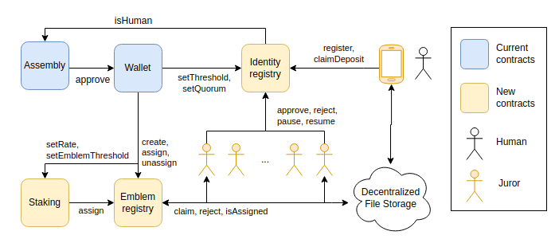

[ [English](README.md) | [Español](README_ES.md) ]

# Sistema de Registro de Identidad

Proponemos un sistema de registro de identidad de seres humanos basado en los siguientes puntos:

- [Humanity Unchained DAO](https://humanityunchained.org) usa como bootstrapping el censo de [Proof of Humanity](https://www.proofofhumanity.id) y su activa comunidad online para crear un contrato social inteligente en el que un fuerte espíritu de colaboración humana hace que valores como la reputación y el altruismo emerjan como pilares fundamentales del sistema. Creemos que, partiendo de este punto, no es estrictamente necesario ni eficiente el basar el sistema de selección de miembros de un jurado para la resolución de disputas solo en incentivos económicos. Creemos que, en casos como el que nos oscupa, el fuerte espíritu de colaboración humana en la comunidad de PoH y el hecho de que las identidades de los jurors son conocidas pueden aprovecharse como ingrediente fundamental para crear un sistema de disputas más robusto, moral y flexible que el basado solo en incentivos economicos.

- Proponemos hacer un sistema similar al de [Proof of Humanity](https://www.proofofhumanity.id), con la diferencia que los miembros del jurado son elegidos por la comunidad a través de la asignación on-chain de tokens `emblemas` a dichos miembros. Si un miembro del jurado no cumpliera con las espectativas de la comunidad, la DAO puede retirar el `emblema` al miembro.

- La DAO siempre puedo aprobar o anular un registro, independientemente del resultado del jurado.

- La DAO votaría, también on-chain, parámetros del sistema como el número de miembros del jurado, el quorum necesario (p.ej. 3 miembros), el umbral de votación (p.ej. > 50%), etc.

- Los miembros del jurado son recompensados con un número de HUD tokens por unidad de tiempo a decidir también por la DAO.

<figure>

 <figcaption>
 Diagrama de el sistema de registro de identidad propuesto.
</figcaption>
</figure>

## Plan

Proponemos el siguiente plan temporal:

1. Debate en comunidad sobre la propuesta en general.

2. Implementación en testnet (Mumbai) [20%].

3. Votación de los miembros del jurado y distribución de los `emblemas`.

4. Votación on-chain para implementación en mainnet (Polygon). Desactivación del oraculo de PoH.
